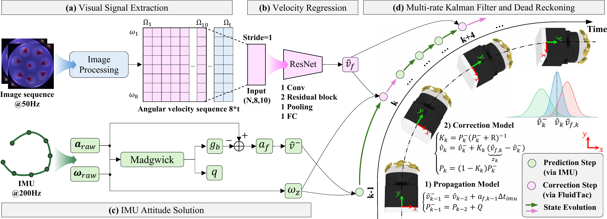

# FluidTac

## A Vision-Based Arrayed Artificial Lateral Line Sensor for Underwater Ego-Motion Estimation

<p align="center">
  <a href="https://doi.org/10.1109/LRA.2026.3732929"></a>
  <a href="https://doi.org/10.1109/LRA.2026.3732929"></a>
  
</p>

**Zhipeng Fei\*, Yicheng Lin\*, Hengpeng Xie, Cong Li, and Bin Han**  

Published in **IEEE Robotics and Automation Letters (RA-L), 2026**.

[[Paper]](https://doi.org/10.1109/LRA.2026.3732929) [[Fabrication Guide]](./FluidTac%20Quick%20Start%20Guide.pdf) [[Code]](./Code) [[Model]](./Model)

## Overview

Reliable ego-motion estimation is essential for autonomous underwater vehicles (AUVs), but conventional sensing methods can degrade in shallow, turbid, and unstructured environments. Doppler velocity logs may lose bottom lock, while vision-based approaches depend on sufficient visibility and image features.

**FluidTac** is a compact, vision-based arrayed artificial lateral line sensor designed to provide robust velocity observations without relying on acoustic bottom tracking or external visual features. Inspired by the lateral line system of fish, FluidTac uses an array of passive propellers to convert local water-flow disturbances into visually observable rotations. A built-in camera tracks the rotational motion of the propellers, and the resulting signals are combined with inertial measurements for underwater ego-motion estimation.

## Method



The proposed framework consists of four main stages:

1. **Visual signal extraction.** A camera captures the passive propeller array at 50 Hz. Image processing and marker tracking recover the angular velocity of each propeller.
2. **Velocity regression.** A sliding window containing the angular velocities of the eight sensing units is processed by a lightweight 1D ResNet to estimate the vehicle's forward velocity.
3. **IMU attitude estimation.** Raw 200 Hz accelerometer and gyroscope measurements are processed using a Madgwick filter to estimate attitude and gravity-compensated forward acceleration.
4. **Multi-rate sensor fusion.** A Kalman filter propagates the state using high-frequency inertial measurements and corrects the velocity whenever a new FluidTac observation becomes available. The fused velocity and yaw rate are then used for planar dead reckoning.

## Sensor Design

FluidTac employs eight passive propeller units arranged in an omnidirectional circular array. Water flow drives the propellers, while red asymmetric markers rigidly connected to their shafts provide visually trackable angular information. A single wide-angle camera observes all sensing units simultaneously, and an annular LED array provides stable internal illumination.

| Parameter | Value |
| --- | ---: |
| Sensor dimensions | 50 × 50 × 75 mm |
| Total mass | 76.17 g |
| Number of propeller units | 8 |
| Sensing diameter | 25 mm |
| Sampling rate | 50 Hz |
| Velocity range | 0.05-0.50 m/s |
| Front flow-angle range | ±90° |
| Velocity relative error | 3.49% |
| Flow-direction error | 1.71° |
| Signal-to-noise ratio | 5.35-10.04 dB |

## Experiments

FluidTac was evaluated through controlled experiments and real-world field trials:

- **Flow-direction sensing:** the sensor was rotated from -90° to 90° in a controlled current.
- **Velocity sensing:** towing experiments evaluated velocity estimation from 0.1 m/s to 0.5 m/s.
- **Ego-motion estimation:** rectangular and circular trajectories were tested in a motion-capture-equipped water tank.
- **Field validation:** FluidTac was integrated into an AUV and tested in a shallow, highly turbid natural lake.

In the controlled ego-motion experiments, FluidTac achieved the following performance:

| Metric | Result |
| --- | ---: |
| Velocity MAE | 7.99 mm/s |
| Velocity relative error | 3.49% |
| Position MAE | 5.48 cm |
| Position RMSE | 6.57 cm |
| Relative position error | 6.85% of traveled distance |

The lake experiments further demonstrated that FluidTac can constrain inertial drift and maintain reliable trajectory estimation in visually degraded, acoustically constrained environments.

## Repository Contents

```text
FluidTac/
├── Code/                         # Source code
├── Model/                        # FluidTac mechanical model
├── FluidTac Quick Start Guide.pdf
└── README.md
```

- [`Code/`](./Code): source code associated with FluidTac.
- [`Model/`](./Model): mechanical model files for the sensor.
- [`FluidTac Quick Start Guide.pdf`](./FluidTac%20Quick%20Start%20Guide.pdf): fabrication and assembly guide.

## Citation

If you find FluidTac useful in your research, please cite our paper:

```bibtex
@article{fei2026fluidtac,
  author  = {Zhipeng Fei and Yicheng Lin and Hengpeng Xie and Cong Li and Bin Han},
  title   = {{FluidTac}: A Vision-Based Arrayed Artificial Lateral Line Sensor for Underwater Ego-Motion Estimation},
  journal = {IEEE Robotics and Automation Letters},
  year    = {2026},
  pages   = {1--8},
  doi     = {10.1109/LRA.2026.3732929}
}
```

## Acknowledgments

This work was supported in part by the Jing-Jin-Ji Regional Integrated Environmental Improvement National Science and Technology Major Project under Grant 2025ZD1206400, the National Natural Science Foundation of China under Grant 52375015, and the Interdisciplinary Research Program (Robotics and Artificial Intelligence) of Huazhong University of Science and Technology under Grant 2024JCYJ037.

## Contact

For questions about FluidTac, please open an issue in this repository or contact the corresponding author, **Bin Han** ([binhan@hust.edu.cn](mailto:binhan@hust.edu.cn)).
